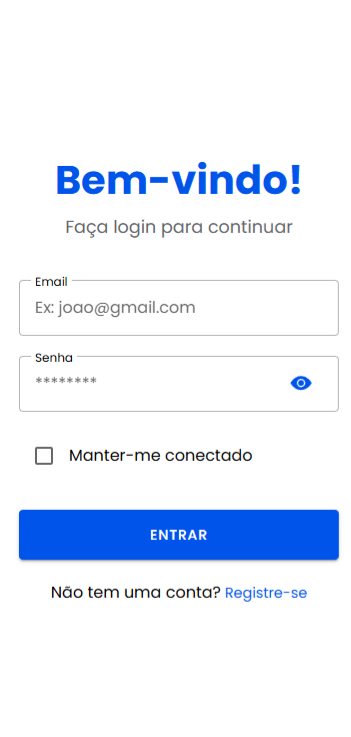
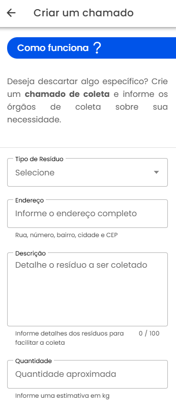
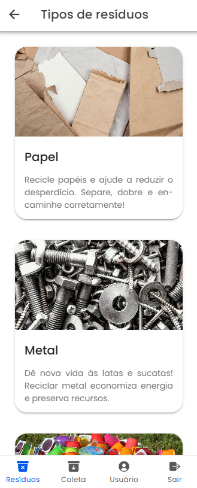
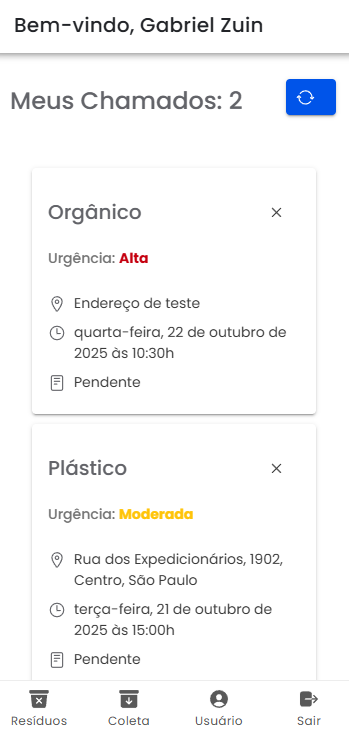
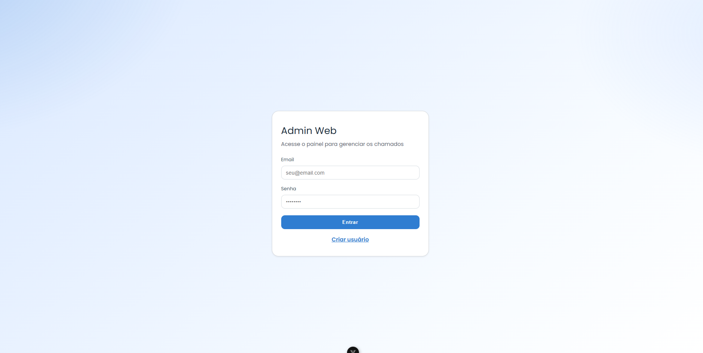
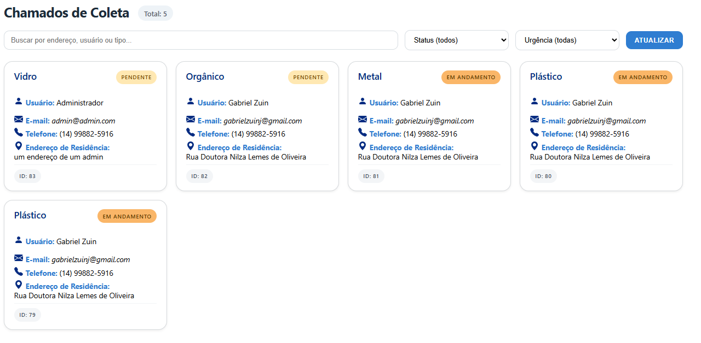
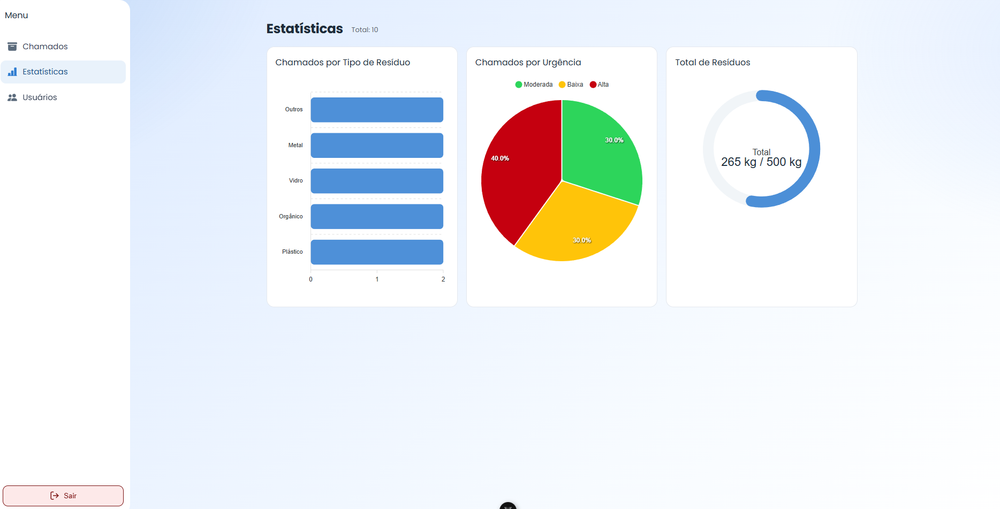

## Waste Collection Schedule Project

This project was developed as the final project for the Computer Engineering degree at UTFPR. The system consists of a platform that allows users to schedule the collection of items they wish to discard or recycle. This process can be done through a mobile application. The collection requests are then received by an admin web application, where they can be viewed and managed.

## 🧰 Main Technologies

- Python
- Django and DRF (Django REST Framework)
- SimpleJWT
- Ngrok
- SQLite
- JavaScript
- Vue and Vite
- Ionic and Capacitor

## 📦 Requirements

- Python
- pip
- npm
- Node

## 🗂️ Project Structure

```
collection_schedule/
├─ backend/        # Django REST API project (auth, core domain, admin, Swagger/Redoc)
│  ├─ app/         # Mobile app API
│  ├─ app_web/     # Admin web API
│  ├─ core/        # Core domain (models and shared entities)
│  └─ schedule_app/# Django project configuration (settings, URLs, WSGI/ASGI)
└─ ui/             # Front-end applications
   ├─ admin-web/        # Admin web app (Vue 3 + Vite)
   │  ├─ src/components/ # Vue components
   │  ├─ src/views/      # Vue views/pages
   │  ├─ src/router/     # Vue router configuration
   │  └─ src/services/   # API service calls
   └─ schedule-app/      # Mobile app (Ionic + Capacitor), includes Android project under "android/"
      ├─ src/            # Ionic app source code
      ├─ android/        # Android project generated by Capacitor
      └─ tests/          # E2E and unit tests
```

## 🚀 Installing and executing

First, clone this repository

```
git clone https://github.com/gabrielzj/collection_schedule.git
```

### 🛠️ 1) Backend

- Verify Python version: `python --version` or `python3 --version`
- Verify pip version: `pip --version`
- Update pip: `python -m pip install --upgrade pip`

```powershell
# 1. First, go to backend directory
cd backend

# 2. Create and activate a python virtual environment
python -m venv venv # create the virtual environment 'venv'
venv\Scripts\activate # Windows
source .venv/bin/activate # Linux/macOS

# 3. Install the dependencies
pip install -r requirements.txt

# 4. Apply database migrations
python manage.py migrate

# 5. Create superuser (to access django admin)
python manage.py createsuperuser

# 6. Start development server
python manage.py runserver
```

Acess `http://localhost:8000/swagger/` to see API documentation.

## 🖥️ 2) Admin Web

Access admin web directory `ui/admin-web`.

```powershell
npm install
npm run dev
```

Access the project at `http://localhost:5173`

## 📱 3) App Mobile

Access the app directory `ui/schedule-app`.

```powershell
cd ui/schedule-app
npm install
```

On Browser:

```powershell
npm run dev or ionic serve
```

On Android Studio:

```powershell
cd ui/schedule-app
npm install

npm run build

# Sync the Android project
npx cap sync android

# Open in Android Studio
npx cap open android
```

## 4) Images

### 📱 Mobile Application

<div style="display:flex; gap:16px; flex-wrap:wrap; align-items:flex-start;">
   <figure style="margin:0; text-align:center;">
      
   </figure>
   <figure style="margin:0; text-align:center;">
      
   </figure>
   <figure style="margin:0; text-align:center;">
      
   </figure>
   <figure style="margin:0; text-align:center;">
      
   </figure>
</div>

### 🖥️ Admin Web

<div style="display:flex; gap:16px; flex-wrap:wrap; align-items:flex-start;">
   <figure style="margin:0; text-align:center;">
      
   </figure>
   <figure style="margin:0; text-align:center;">
      
   </figure>
   <figure style="margin:0; text-align:center;">
      
   </figure>
   <figure style="margin:0; text-align:center;">
      
   </figure>
</div>
